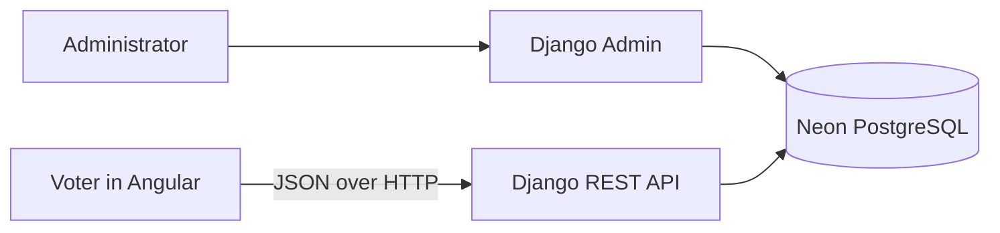
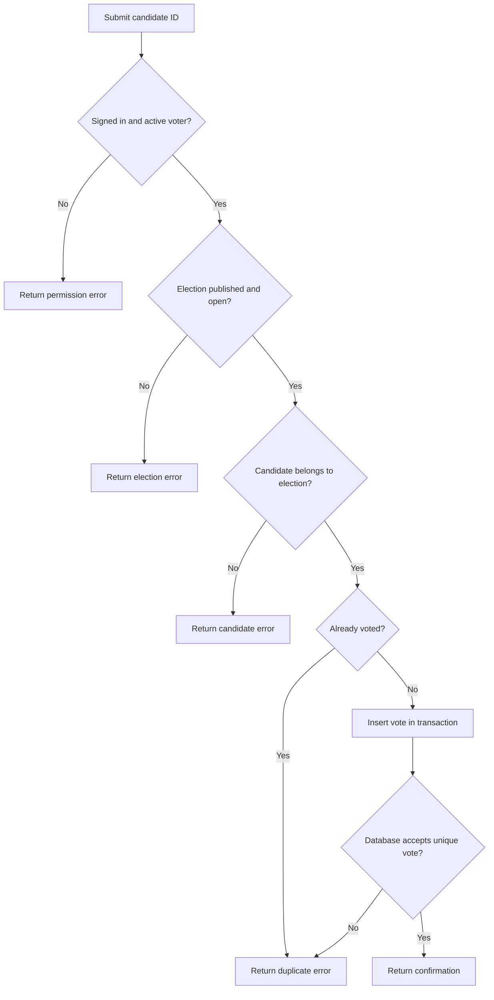
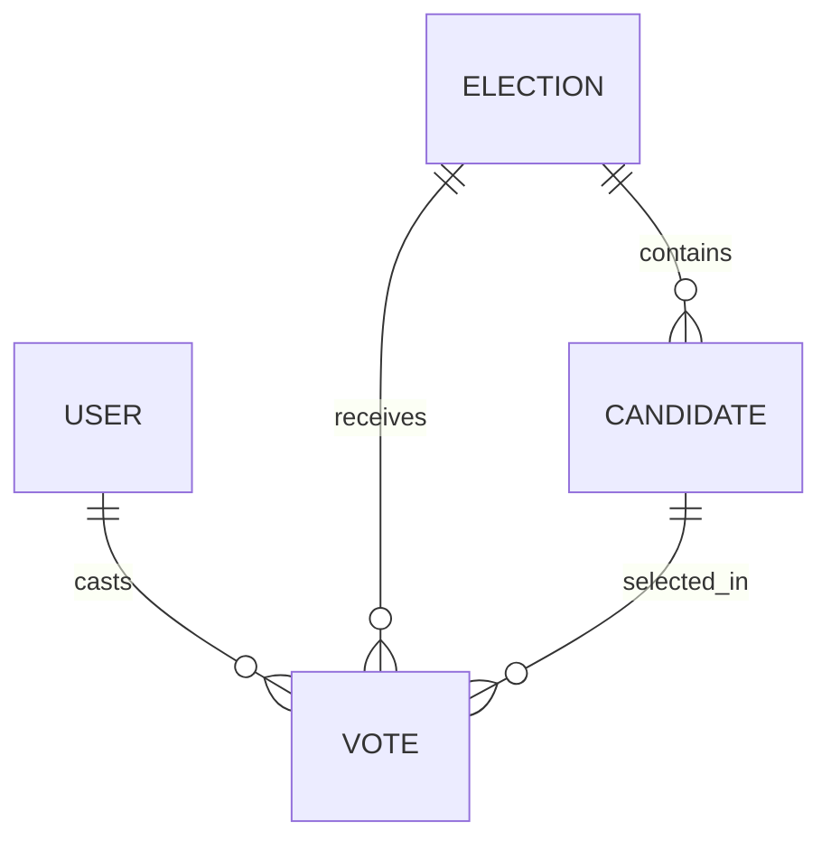

# Online Voting System — Project documentation draft

## 1. Cover Page

- **Course:** Principles of Programming Languages
- **Group:** Group 5
- **Project:** Online Voting System
- **Submission date:** [Fill in]
- **Instructor:** [Fill in]

## 2. Project Title

Online Voting System for Classroom Elections

## 3. Group Members

[Add each member's full name and section.]

## 4. Project Description

A classroom election application in which an administrator prepares voter accounts, an election, and its candidates. A signed-in voter can submit one ballot in the election. The system stores votes in a relational database and shows totals after the election closes. The Angular voter interface and Django REST API are implemented.

## 5. Problem Statement

Manual classroom voting can require paper counting and may allow accidental duplicate ballots. The project demonstrates how an application can validate voter eligibility, accept a ballot, reject duplicate submissions, and calculate results consistently.

## 6. Project Objectives

1. Let an administrator set up an election and candidates.
2. Let a registered voter submit exactly one ballot per election.
3. Reject invalid candidate IDs, closed elections, and repeat attempts with clear errors.
4. Store ballots persistently and calculate results after closing.
5. Demonstrate at least five Principles of Programming Languages concepts in working code.

## 7. Scope and Limitations

The MVP supports one candidate choice per voter per election. Administrators create accounts through Django Admin. Results appear only after closing. It does not include self-registration, identity verification, multiple positions on one ballot, or anonymous ballots. Vote records link voters to their selections, so this is a course prototype rather than a public-election system.

## 8. Programming Language Used

Python is used in the Django backend. The Angular frontend uses TypeScript. SQL is used by the relational database through Django's model layer; Neon PostgreSQL is the intended shared database.

## 9. Programming Paradigm Used

The backend combines procedural functions for validation and vote processing with object-oriented classes for models, serializers, and API views. The Angular frontend responds to sign-in, candidate selection, review, submission, and navigation events.

## 10. Principles of Programming Languages Applied

See `REQUIREMENTS_AUDIT.md` for the code-level evidence. The strongest examples are variables and data types, Boolean expressions, control structures, functions, data structures, exception handling, modularity, and object-oriented programming.

## 11. System Features

- Session login and logout with CSRF protection.
- Published election and candidate listing.
- One-vote-per-voter ballot submission.
- Election opening and closing times.
- Results with vote totals after closing.
- Django Admin for accounts, elections, and candidates.
- Responsive Angular pages for sign-in, election cards, ballot review, confirmation, and results.

## 12. System Design and Architecture

The Angular frontend and Django API were connected in a local browser test. During local development, the backend can use SQLite when a Neon connection string is unavailable; Neon integration still needs a live connection test.

## 13. Program Flowchart

## 14. Database Design

`Election` stores title, description, opening and closing times, and publication state. `Candidate` stores a name, statement, and election reference. `Vote` stores a voter, election, candidate, and submission time. The database enforces one `Vote` for each `(election, voter)` pair. Django's built-in `User` table stores accounts.

## 15. Source Code

The backend source is in `backend/`. The central files are `voting/models.py` (data rules), `voting/serializers.py` (input types), `voting/services.py` (vote processing and exceptions), `voting/views.py` (API output), `voting/auth_views.py` (session login), and `voting/tests.py` (verification). The Angular source is in `frontend/src/app/`, with API calls in `api.service.ts` and pages in `pages/`. Include the repository or printed excerpts according to the instructor's submission format.

## 16. Screenshots of the System

[Add screenshots of login, election list, ballot, successful vote, rejected second vote, results, and Django Admin. The Angular screens are implemented and ready to capture.]

## 17. Testing Results

The Django backend passes 12 automated tests. The tested cases include successful voting, stored vote retrieval, duplicate rejection, invalid input, foreign candidate rejection, election time boundaries, results visibility and totals, unpublished elections, permissions, invalid date validation, malformed JSON, and CSRF session behavior. The Angular production build and two frontend utility tests pass. A manual browser flow verified sign-in, election listing, ballot confirmation, persisted vote status after refresh, and closed-election results with local SQLite data. Add live Neon results here when completed.

## 18. Individual Member Contributions

| Member | Backend or frontend work | Tests and documentation | Presentation role |
| --- | --- | --- | --- |
| [Name] | [Specific work] | [Specific work] | [Section] |

Add one row for every group member and make sure each person presents a part of the demonstration.

## 19. Conclusion

The application demonstrates that input validation, Boolean rules, functions, and exception handling can coordinate a one-vote workflow across Angular and Django. The remaining work is to verify Neon in the group's environment, complete screenshots, and rehearse the full demonstration.

## 20. References

- [Django documentation](https://docs.djangoproject.com/en/6.0/)
- [Django REST Framework documentation](https://www.django-rest-framework.org/)
- [Angular documentation](https://angular.dev/)
- [Neon documentation](https://neon.com/docs/)

## Presentation coverage checklist

The final presentation should cover the introduction, problem, objectives, target users, languages, paradigms, PPL concepts with code examples, features, live demonstration, testing, problems and solutions, member contributions, and conclusion. Assign at least one speaking segment to every group member.
